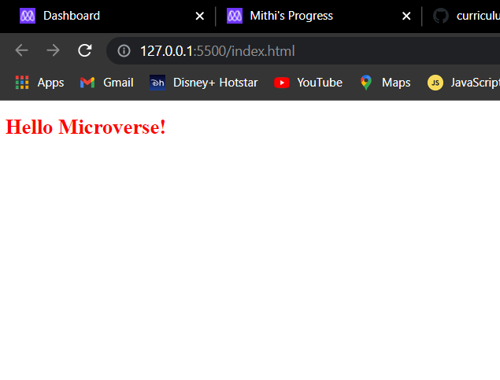

# Hello Microverse project

> set up of a "Hello world" repository. No complex coding

Additional description about the project and its features.

## Built With

- HTML, CSS
- stylelint

## Getting Started
To get a local copy up and running follow these simple example steps.

### Prerequisites
live server vscode extention
### Setup
Open with live server on vscode
### Install
no installations

## Authors

👤 **Author1**

- GitHub: [@githubhandle](https://github.com/Mithi-code)
- Twitter: [@twitterhandle](https://twitter.com/LazyMithlesh)
- LinkedIn: [LinkedIn](https://www.linkedin.com/in/mithlesh-kumar-564a97221/)

## 🤝 Contributing

Contributions, issues, and feature requests are welcome!

Feel free to check the [issues page](https://github.com/Mithi-code/Hello-Microverse/issues).

## Show your support

Give a ⭐️ if you like this project!

## Acknowledgments

- Hat tip to anyone whose code was used
- Inspiration
- etc

## 📝 License

This project is [MIT](./MIT.md) licensed.
